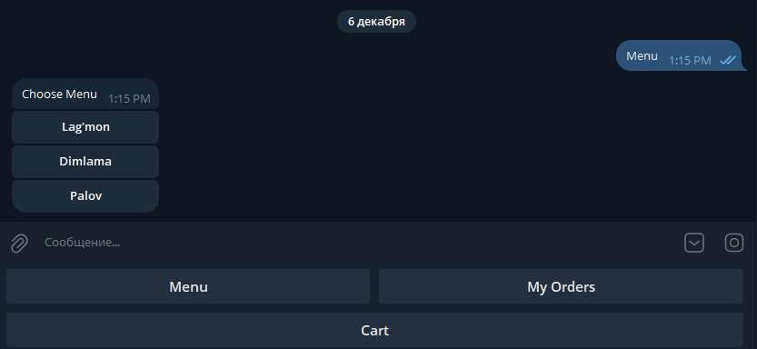
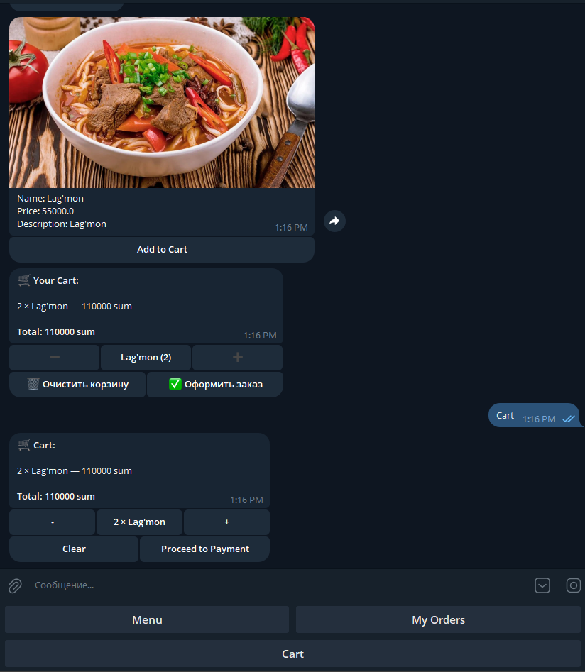
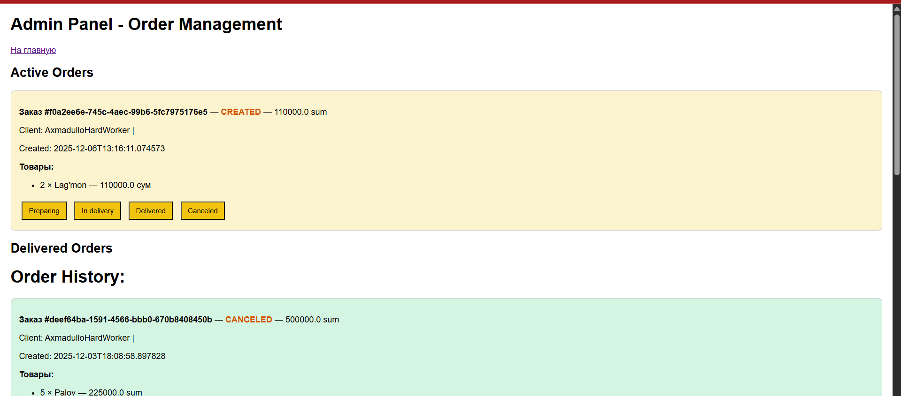

# Girgitton Bot — Telegram-бот ресторана с онлайн-заказами

**Самый чистый, быстрый и профессиональный бот доставки еды на Java в СНГ**  
Полноценная система заказов с корзиной, админкой в Telegram и красивой архитектурой — **без Spring, без лишнего, только суть**.

Живой бот: @girgitton_bot (если уже запущен — вставь ссылку)

## Что умеет (и делает это идеально)

- Красивое меню с фото, ценами и описаниями
- Корзина (добавить, +/–, удалить)
- Оформление заказа за 1 клик
- Автоматические уведомления клиенту при смене статуса
- Полноценная админ-панель прямо в Telegram:  
  → Все активные заказы  
  → История заказов  
  → Смена статуса одним нажатием
- Поддержка кириллицы, эмодзи, инлайн-кнопок
- Никаких N+1 запросов — всё грузится через JOIN FETCH

## Технологии — только лучшее и только нужное

| Что используется              | Версия / Примечание                          |
|-------------------------------|-----------------------------------------------|
| Java                          | 17+                                           |
| Telegram Bot API              | pengrad/java-telegram-bot-api 6.9.7.1         |
| JPA / Hibernate               | Hibernate 7.0 + Jakarta Persistence 3.2       |
| База данных                   | PostgreSQL 15+                                |
| Архитектура                   | Чистый слойный подход + Singleton Repository  |
| DI                            | Ручной (никаких Spring, CDI и прочей магии)   |
| Сборка                        | Maven → WAR (можно деплоить хоть куда)        |
| Аннотации                     | Lombok                                        |
| JSON                          | Jackson 2.15                                  |

**В проекте нет Spring, нет Spring Boot, нет @Autowired — только чистый, понятный и контролируемый код.**

## Структура — как в enterprise, но без переусложнений.

## Скриншоты (вставь свои — будет огонь)





## Как запустить локально (30 секунд

```bash
git clone https://github.com/tvoy-nick/girgitton-bot.git
cd girgitton-bot

# 1. Создай БД
createdb girgitton

# 2. Настрой токен бота в BotConfig.java или .env
# 3. Запусти
mvn clean compile exec:java -Dexec.mainClass=uz.pdp.restaurantproject.BotApplication

Или просто собери WAR и кинь в Tomcat 10+ — тоже полетит.
Особенности, которыми можно гордиться

Вся бизнес-логика корзины и статусов — в одном OrderService (чистый, читаемый, тестабельный)
При оформлении заказа старая корзина становится заказом, а пользователю сразу создаётся новая пустая — идеально
Все связанные сущности подгружаются одним запросом — никаких LazyException
Уведомления отправляются и клиенту, и админу автоматически
Полностью готов к масштабированию: добавляй курьеров, филиалы, скидки — всё легко

Сделано одним разработчиком за кофе и ночи — и работает лучше, чем у 90% заведений в городе.
